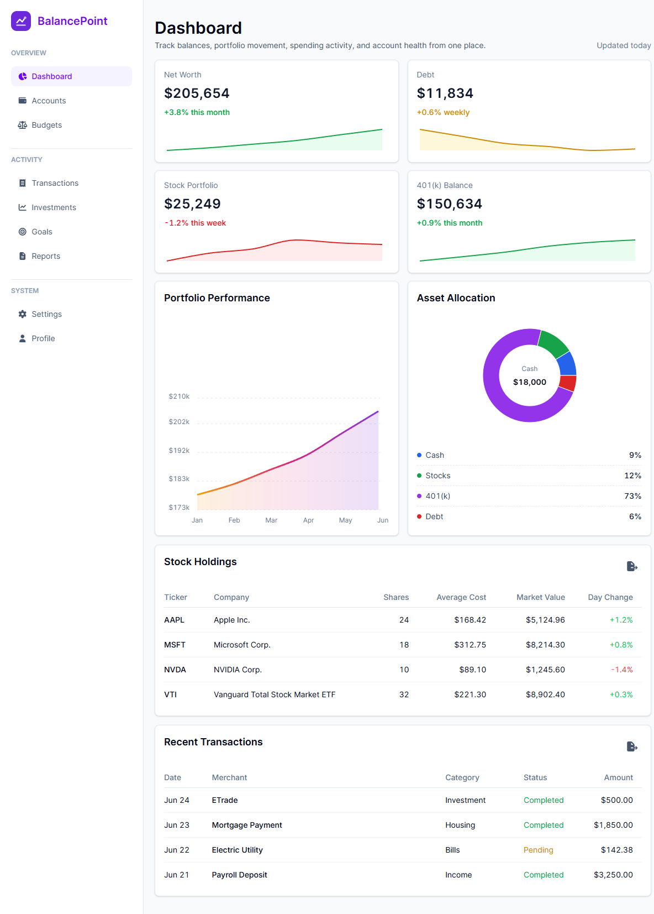

<div align="center">
  <table>
    <tr>
      <td>
        
      </td>
      <td>
        <span style="color:#6D28D9; font-size:32px; font-weight:700;">
          BalancePoint
        </span>
      </td>
    </tr>
  </table>
</div>



## About BalancePoint

**BalancePoint** is a personal front-end project representing a polished financial dashboard experience. The app focuses on responsive layout, interactive dashboard components, chart customization, loading states, and modern UI patterns commonly found in professional SaaS and finance applications.

The goal of this project is to demonstrate practical front-end development skills using a modern Next.js stack while creating an interface that feels clean, useful, and production-minded.

## Features

- Responsive dashboard layout with a mobile header and desktop sidebar
- Collapsible mobile navigation menu with grouped navigation sections
- Dashboard metric cards with hover and flip animations (flip cards to display table view of the data displayed in the graph)
- Customized Recharts area chart displaying performance of portfolio over a 6 month period
- Interactive donut chart displaying allocation of assets
- Stock holdings and recent transactions tables
- PrimeReact skeleton loading states using Next.js route-level loading UI

## Local Development

Clone the repository:

```bash
git clone YOUR_REPOSITORY_URL
```

Move into the project folder:

```bash
cd financial-app
```

Install dependencies:

```bash
npm install
```

Start the development server:

```bash
npm run dev
```

Open the app in your browser:

```text
http://localhost:3000
```

Build the production version:

```bash
npm run build
```

Run the production build locally:

```bash
npm run start
```

## Live Demo

View the deployed site on Vercel:

[BalancePoint on Vercel](https://financial-app-project-bunuvzuwe-austin-tillotsons-projects.vercel.app/)

## Tools And Frameworks

- **Next.js** - React framework with App Router routing and layouts
- **React** - Component-based UI development
- **TypeScript** - Static typing for safer component and data modeling
- **Tailwind CSS** - Utility-first styling and responsive design
- **Recharts** - Custom financial charts and dashboard visualizations
- **PrimeReact** - Skeleton loading components and future UI component support
- **Font Awesome** - Navigation and action icons
- **Vercel** - Deployment and hosting
